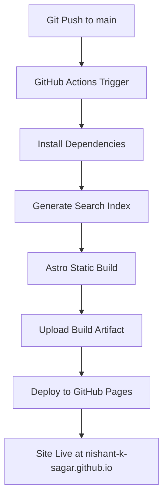

# GitHub Pages Deployment Plan
## Target Domain: `nishant-k-sagar.github.io`

---

## Overview
Complete end-to-end deployment plan for static Astro portfolio on GitHub Pages with full CI/CD automation, following all project architecture rules.

---

## Deployment Workflow


## Action Plan

| Status | Task | Description |
|---|---|---|
| [ ] | Update `astro.config.mjs` | Set correct site URL once |
| [ ] | Verify GitHub workflow file | Validate `.github/workflows/deploy.yml` exists and matches spec |
| [ ] | Update author schema | Set correct profile URLs for Nishant K Sagar |
| [ ] | Verify build command locally | Run `npm run build` locally to confirm zero errors |
| [ ] | Validate search index script | Confirm search index generation runs without errors |
| [ ] | Check all content status | Ensure published content has correct frontmatter |
| [ ] | Verify .gitignore | Ensure /dist directory is correctly excluded |
| [ ] | Initial commit | Commit all deployment configuration |
| [ ] | Push to GitHub | Push code to main branch |
| [ ] | Configure repository settings | Enable GitHub Pages with Actions source |
| [ ] | Monitor deployment | Verify first workflow run completes successfully |
| [ ] | Validate live site | Confirm site loads correctly at target domain |
| [ ] | Post deployment checks | Verify links, sitemap, RSS and search functionality |
| [ ] | Performance audit | Run Lighthouse audit on deployed site |

---

## Step-by-Step Todo List

```markdown
- [ ] Update site property in astro.config.mjs to https://nishant-k-sagar.github.io
- [ ] Verify .github/workflows/deploy.yml exists with correct workflow
- [ ] Update author name and profile URLs in BaseLayout.astro SEO schema
- [ ] Run local build validation: npm run build
- [ ] Confirm search index generation script runs without errors
- [ ] Check all content files have valid frontmatter and status
- [ ] Ensure no draft content is accidentally marked as published
- [ ] Verify .gitignore correctly excludes /dist directory
- [ ] Create initial commit with all deployment configuration
- [ ] Push code to main branch on GitHub
- [ ] Enable GitHub Pages in repository settings
- [ ] Select GitHub Actions as build and deployment source
- [ ] Monitor first workflow run for successful completion
- [ ] Verify site is accessible at https://nishant-k-sagar.github.io
- [ ] Validate all internal links work correctly
- [ ] Verify sitemap and RSS feed are correctly generated
- [ ] Confirm search functionality works on live site
- [ ] Run Lighthouse audit on deployed site
```

---

## Required File Changes

### 1. `astro.config.mjs`
```javascript
export default defineConfig({
  site: 'https://nishant-k-sagar.github.io',
  base: '/',
  output: 'static',
  integrations: [tailwind(), mdx(), sitemap()]
})
```

This single change propagates correctly to all absolute URLs, canonical tags, sitemap entries, RSS links and OG image paths automatically.

### 2. `.github/workflows/deploy.yml`
- Uses official Astro GitHub Action v3
- Generates search index before build
- Has correct permissions for Pages deployment
- Includes workflow dispatch for manual triggers

### 3. `src/layouts/BaseLayout.astro`
- Update author name to "Nishant K Sagar"
- Update JSON-LD Person schema with correct GitHub and LinkedIn profiles

---

## Repository Settings Configuration

1. Go to GitHub repository → Settings → Pages
2. Under **Build and deployment**
3. Set Source: `GitHub Actions`
4. Do NOT use legacy `/docs` or `/root` sources
5. Enforce HTTPS is enabled

---

## Publishing Workflow After Deployment

```
1. Edit markdown content file
2. Set status: published
3. git add .
4. git commit -m "publish: <content title>"
5. git push origin main
6. GitHub Actions automatically builds and deploys
7. Site is live within ~60 seconds
```

---

## Post Deployment Verification Checklist

✅ **Build Pipeline**
- Workflow runs successfully on every push to main
- Build completes with zero errors and warnings
- Search index is generated correctly
- No draft content appears on live site

✅ **Site Functionality**
- All routes resolve correctly
- Internal links are not broken
- Dark / Light mode works
- Search returns expected results
- Tags filter correctly
- Timeline loads properly

✅ **Performance & SEO**
- Lighthouse Performance score ≥ 90
- Sitemap is accessible at /sitemap.xml
- RSS feed is accessible at /rss.xml
- Meta tags and canonical URLs are correct
- No console errors in browser

---

## Rollback Procedure
If deployment fails or introduces issues:
1. Revert problematic commit
2. Push revert commit to main
3. Workflow will automatically redeploy previous working version
4. No manual intervention required

---

## Success Criteria
Deployment is complete when:
- [ ] Site loads without errors at `https://nishant-k-sagar.github.io`
- [ ] All content is correctly displayed
- [ ] CI/CD pipeline works automatically on push
- [ ] Search functionality works
- [ ] Lighthouse score meets performance targets
- [ ] No broken links on the site

---

## Forbidden Changes
- Do NOT change `output: static` in Astro config
- Do NOT add any server adapters
- Do NOT manually deploy `/dist` folder
- Do NOT add additional GitHub workflows
- Do NOT use any external hosting services
- Do NOT introduce runtime data fetching
